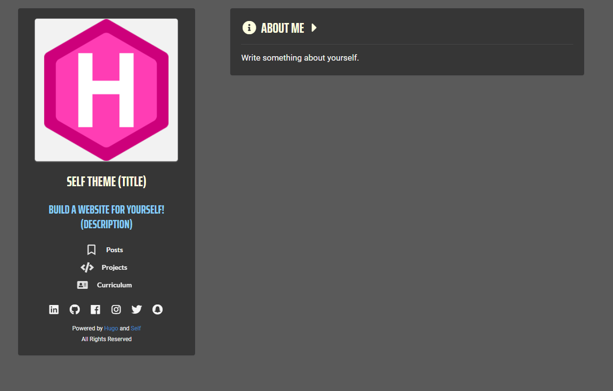

# Self
## A minimal theme for HUGO static site generator

> Theme's style preview

---

After attempting to build my own personal website (https://github.com/NtinosNG/kbazoukis) by getting inspiration from various minimalistic themes for Hugo, I decided to convert my own design into a theme for Hugo so that it can be used by anyone.

When ready, the theme will still be using Semantic-UI CSS framework for styling and responsiveness and Javascript for the various interactive parts (if any; it's still a work in progress) as I have already used for my personal website. It features 2 columns where the first is for navigation and the second is for any content. By default the 4 following sections will be included:

1. Home / About

    > This is used as the about section but also the homepage. The profile photo is used as a Home/About button where you can navigate back from any other section.

2. Posts 

    > This section will be used as a blog where you can post whatever you want! 

3. Projects

    > This section is identical to the Posts section with the only difference that every project will have a preview picture on both the navigation and the main content page of each project.

4. Curriculum

    > This section will feature a tabular approach for a dynamic cv! Initially, it will have 4 columns: Experience, Education, Skills and Interests.

Both the Posts and the Projects sections will show a timestamp and a rough estimation of how much time it will take the reader to read it, as well as pagination to keep things tidy. The navigation column, apart from the links to the sections, it also has various social sites. Initially it has the (ones that I think are the) most popular: LinkedIn, GitHub, Facebook, Instagram, Twitter and Snapchat, but you can change them by following the instructions on the config.toml file on the root folder of the theme. On this file you can also change the basic information at the navigation column such as the title, the description and add your own picture on the static/img folder on the theme's folder. 

Finally, it should be noted that pretty much everything will be possible to change on the design (even CSS for the styling!) by editing the html code of a given section on the partials folder on theme's folder. Even if you don't have much experience, I believe that you will be able to remove, add or modify anything (such as the columns on the cv for example) as I have (tried to!) kept my code as simple and descriptive as possible!   

---

You can try it on your own by doing the following simple steps:

- Install Hugo on your operating system by following the corresponding installation process on https://gohugo.io/getting-started/installing/.

- After installing Hugo (assuming globally), open a terminal or command prompt (for windows) and type:
    
    > Hugo new site 'name of your site' (without the quotes)

- Next (assuming you have git installed on your computer), navigate on the theme folder and clone this repository.

- After you have cloned the rep on the themes folder, navigate back on the root and open the config.toml with any editor and add the following line at the end:

    > theme = "self"

- After saving config.toml, type the following command to complile all the assets * :
    
    > Hugo 

    *After typing Hugo, you might notice that a folder called 'public' appeared on the root. If you want to restart the process for any reason, just delete this folder and type the command again.

- Finally, type the following command to preview the website on a local server:

    > Hugo Server

Currently, only the About/Home section is operational and editable as well as the information on the navigation column. The other sections are still "Under Construction"!

---

#### A live demo of my website and basically, this theme's design 

* https://kbazoukis.com/

---

#### More information about Hugo

* https://gohugo.io -> Main Hugo website
* https://themes.gohugo.io/tags/minimal/ -> Other minimalistic themes

