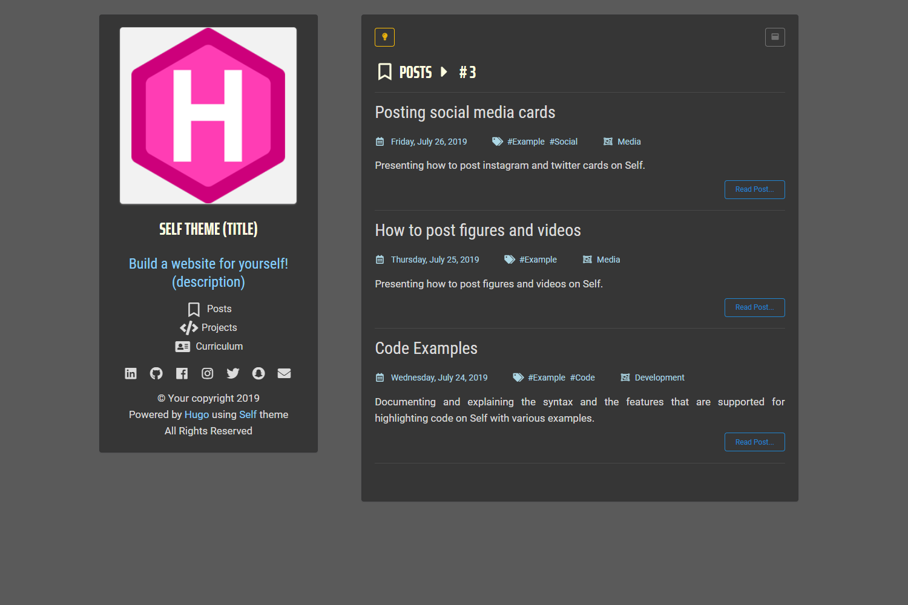

# Self
## *Build a Website for yourself!*




> Self's Design Preview

---

## Demo and Analytical Guide

The most recommended guide to install **Self** can be followed by visiting this [link](https://selfdemo.netlify.com/project/self-theme/) from its demo site as it contains detailed information which is ideal for non-technical people. After you read it make sure to check the POSTS section as it contains posts that explain how to use it afterwards (how to post content and what type of content is supported). However, you can see some parts from the demo guide in this README file.

<br/>

---

## General Information

Self is a theme that was designed from scratch for anyone to use with [HUGO](https://gohugo.io), mostly as a personal website, blog, or portfolio, but it also offers the option to build a dynamic CV! It has a mininal two-column materialistic design, it is responsive and has support for features such as Google Analytics and Disqus.

Self was built using [**_Semantic-UI_**](https://semantic-ui.com) CSS framework for its styling and Javascript for the various interactive features that it supports.

---

## Getting Started

Building your website with HUGO and Self is a three-step process. Here you'll find the requirements and the steps for the installation process.

### Requirements

* [HUGO](https://github.com/gohugoio/hugo/releases/)
* [Git](https://git-scm.com/downloads) (optional)


## Step 1

First, you need to download HUGO and install it globally for your operating system. Visit the link from the requirements above and download the latest release. Next, install HUGO globally by checking the official [guide](https://gohugo.io/getting-started/installing/) to find out how to do that for your operating system.

After you've installed HUGO, you can verify its installation by running the following command on a terminal:

```
hugo version
```

## Step 2

In this step, you'll build a new website with HUGO. First, open a terminal and navigate to a directory you want to build your site (this could be your Desktop for example):

```
cd <PATH OF SOME DIRECTORY>
```

Next, type the following command to build a HUGO website:

```
hugo new site <NAME OF YOUR SITE>
```

The *&lt;NAME OF YOUR SITE&gt;* could be anything and of course it should be without the &lt; and &gt; signs. Morever, it would be best to add a name without any spaces to prevent any errors from occuring.

With the previous command, you have built a website with the name you provided. Navigate on that directory and you'll notice the following contents:

- archetypes
- content
- data
- layouts
- static
- themes 
- config.toml

Apart from the *confing.toml* file all the other contents are directories. At this point, you have the base structure of your site ready. All that is required now is to download Self. 

## Step 3

In this final step you're going to install Self and build your website. 

Navigate to the *themes* directory in your website's directory that you'd build in the previous step and then if you have Git installed type the following command on your terminal:

```
git clone https://github.com/NtinosNG/self.git
```

This will clone Self theme on your themes directory. 

If you don't have Git installed on your computer, you can either download it and install it by following the link from the requirements above, or you could click on -> clone or download -> Download ZIP. After it's downloaded, extract it and move it in the themes directory of your website. Then rename the directory from "self-master" to "self" (lower case as you see it) without the quotes. 

At this point, there is one last part remaining before you can build your site. Navigate in the self directory and then copy the contents of the exampleSite directory. These contents should be:

> content

> config.toml

Then, navigate back to the root of your website and paste those contents by replacing the existing ones. **This is important** because, the *content* directory you copied contains the necessary front matter for the content you'll be posting on your site while the *config.toml* contains the necessary configuration for building your site. Furthermore, if you don't do that you'll probably run into some errors after you build your site.

After you've copied *exampleSite's* contents, you are finally ready to build your site. Just open a terminal on the root of your website and simply type:

```
hugo
```

If everything went well, you should see something like that:

```
$ hugo
Building sites …
                   | EN
+------------------+----+
  Pages            | 13
  Paginator pages  |  0
  Non-page files   |  3
  Static files     | 41
  Processed images |  0
  Aliases          |  2
  Sitemaps         |  1
  Cleaned          |  0

Total in 1513 ms
```

You should also be able to see a directory named *public* in your root.

Lastly, you can see your newly built site by running a local server with hugo by typing the following command on your root:

```
hugo server
```

## Setting up config.toml

Now that you have built the website, the first action that is required to start setting up your site by editing the configuration file "***config.toml***". 

This file contains some required settings and some other optional ones which will enable or disable some features that you might want to use or not. When you open it you'll see the following settings:

- baseURL = "[https://example.com](https://example.com)"
- theme = "self"
- languageCode = "en-us"
- title = "Self"
- copyright = "&ampcopy; Your copyright"
- paginate = 3
- googleAnalytics = " "
- disqusShortname = " "

### \[params\] 

- analytics = false
- comments = false
- year = "true"
- HomePosts = "disable"
- postsCounter = ""
- cvCounter = "disable"
- author = "Your name"
- profileImage = "/uploads/profile.png"
- siteName = "Self Theme (title)"
- description = "Build a website for yourself! (description)"
- AllDisabled = "false"
- linkedin = "#"
- github = "#"
- facebook = "#"
- instagram = "#"
- twitter = "#"
- snapchat = "#"
- mail = "#"
- cv ="true"
- tab1 = "Experience"
- tab2 = "Education"
- tab3 = "Skills"
- tab4 = "Awards"
- tab5 = "Interests"

You can start setting it up by reading the explanatory comments above each setting that start with # hashtags.